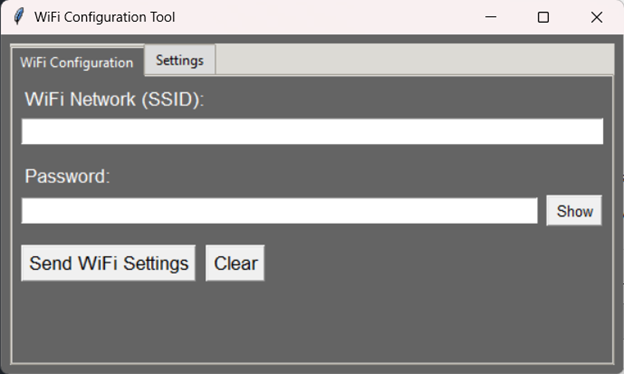
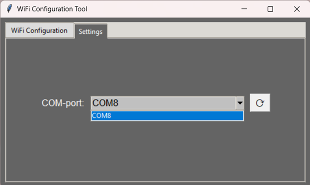
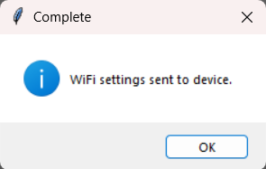
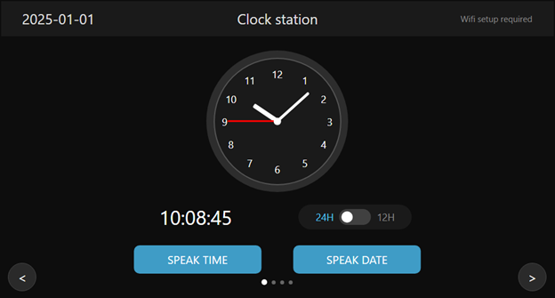
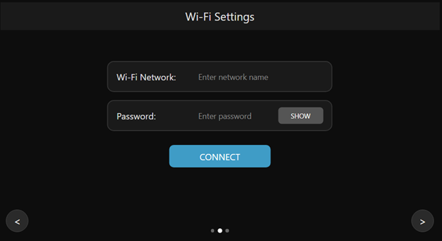
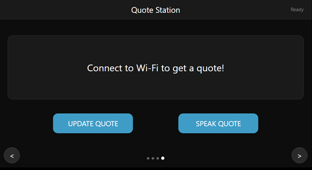

# ESP32-S3 based assistant with voice synthesis, clock, weather forecasting, quotes and Desktop App for Wi-Fi settings input

**Summary:** This repository combines firmware for ELECROW CrowPanel Advance 7.0 (ESP32-S3, 800×480 display, with 8MB flash memory) with an LVGL-based multi-screen UI and a desktop Python application for WiFi configuration. The system provides voice synthesis for time, date, and weather information through the GRC HxTTS module, with automatic time synchronization, timezone detection weather forecasting and quote services.

---

# Repository Structure

- `firmware/` — flashing utility and prebuilt binaries.
- `main/` — firmware source code (ESP-IDF): LVGL UI, UART manager, weather services, time management, quote services, HxTTS integration, etc.  
- `python/app/` — desktop GUI application for WiFi configuration and device setup.  
- `components/ui/` — custom LVGL interface implementation (4-screen design)  

---

# Features 

- **End-to-end integration:** Desktop → CrowPanel → GRC HxTTS.  
- **Embedded device focus:** Designed for ELECROW CrowPanel Advance 7.0-HMI. For detailed device hardware information, see [Device Hardware Documentation](https://www.elecrow.com/wiki/ESP32_Display-7.0_inch%28Advance_Series%29wiki.html).  
- **Convenient desktop GUI:** Enter Wi-Fi credentials, select COM port, send configuration on data and monitor device.  
- **Reliable transmission:** Compact JSON format with CRC32 checksum validation for configuration data integrity.  
- **Multi-screen LVGL UI interface:** Four dedicated screens for Clock (analog and digital)/Date, WiFi setup, Weather station and Quotes with swipe or buttons navigation.
- **Voice synthesis integration:** GRC HxTTS module for natural speech output of time, date, weather information and inspirational quotes.
- **Automatic time management:** NTP synchronization with IP-based timezone detection and 12/24h format support.
- **Complete weather station:** Current conditions, today's forecast (9:00, 15:00, 21:00), and 3-day outlook via OpenWeatherMap API with push-button updates.
- **Geolocation services:** Automatic city detection via IP-API with manual override capability.
- **Inspirational quotes service:** Random quote fetching from API with fallback quotes and voice synthesis capability.


---

# Usage 

> **IMPORTANT:** Order of actions matters — first connect the CrowPanel to your computer via USB/Serial, then flash the board, then connect the GRC HxTTS module, and finally launch the Python application.

1. **Hardware setup (initial)**  
   - Set the function-select switch on the CrowPanel to **WM**(0,1) (UART1-OUT mode).  
   - Connect the CrowPanel to the PC via USB/Serial.  
   - **Do NOT connect the GRC HxTTS module yet.** The HxTTS module must be connected only after the panel firmware has been flashed (see note below).  
  
2. **Flashing the board**
 
   ### Building from Source

   1. Install ESP-IDF framework v5.5.  
   2. Clone the repository.  
   3. Dependencies are managed via the ESP-IDF component manager (`idf_component.yml`).  
   4. Build and flash with:  
      ```bash
      idf.py build
      idf.py -p PORT flash
      ```

   ### Flashing Prebuilt Images

   - Use `firmware/FlashTool_s3.exe` to flash the prebuilt images.
  
3. **Hardware setup (post-flash)**  
   - After flashing completes and the device has rebooted, connect the GRC HxTTS module (UART0) and CrowPanel (UART1-OUT) using a 4-pin adapter.  
   - Connect the audio output (3.5 mm mini jack) from the HxTTS module to the speaker/headphones.

4. **Running the Python app**  
   - Go to `python/app/`.  
   - Launch the app: `app.exe` or `python main.py`.  
   - Select the panel’s COM port, enter Wi-Fi credentials, and press **Send WiFi Settings**.  

5. **Verification**  
   - If the data transfer is successful and you press the "connect" button, the panel will attempt to connect to WiFi and display status messages.
   - Upon successful WiFi connection, the device will automatically switch to the main weather screen.
   - Time synchronization and weather data collection will begin automatically.
   - Voice functionality becomes available for time, date, weather announcements and quote reading.
   - Navigate between screens using swipe gestures or navigation buttons to access all features.
   - If the connection attempt is unsuccessful, enter the correct Wi-Fi credentials and resubmit.

6. **Configuration (Optional)**
   OpenWeatherMap API Key: The application includes a default API key for testing. For production use or to avoid rate limiting, you can use your own key:
   1. Obtain an API key from OpenWeatherMap.
   2. Locate the OPENWEATHER_API_KEY constant in main/weather_service.h line 7.
   3. Replace the existing key with your own.
   4. Rebuild and reflash the device again.

---

# How to use Python app

1. Run `app.exe` from `python/app/` (or `python main.py` from `python`).  
2. In the **WiFi Configuration** tab, enter SSID and password into the respective fields.  
3. In the **Settings** tab, select the device’s COM port (use **⟳** to refresh the list).  
4. Return to **WiFi Configuration** and press **Send WiFi Settings** — the credentials will be sent to the panel.  
5. After transmission, a dialog box will appear indicating success or error:
   - **Success**: "WiFi settings sent to device" - credentials are delivered to the panel
   - **Error**: Specific failure reason (COM port access denied, device not responding, etc.)
6. The device's display will show the received WiFi credentials on the WiFi setup screen, and a connection attempt will begin when you press the "connect" button.
7. Before updating firmware, close the app to release the COM port. 
> **Note:** During the initial Wi-Fi setup, the device may reboot to initialize the network interfaces via a COM port connection. In this case, simply re-send the Wi-Fi credentials.
>If Wi-Fi fails to connect, enter the correct credentials and resend them to unlock the connection button on the panel.

### Example usage

Below is an example screenshot showing the application with filled fields, COM port selected, and data being sent successfully:

  
  
  

---

# UI (Custom LVGL Implementation)

- The UI is implemented in `components/ui` as a custom 4-screen design.  
- Screen 1 - Clock station: Analog and digital clock display with date, format toggle, and voice buttons.
    
- Screen 2 - Wi-Fi Setup: Credential display, connection status, and manual connect trigger.
  
- Screen 3 - Weather Station: Current conditions, today's forecast and 3-day forecast with voice synthesis buttons.
  
- Screen 4 - Quotes Screen: Inspirational quotes display with author attribution, update button and voice synthesis button.
  
- Navigation between screens via swipe gestures or corner navigation buttons

### Key UI features:
- Intelligent button state management: Buttons are disabled during TTS playback or data refresh and automatically enabled again.
- Real-time status updates: Connection, time sync, and weather update status.
- Visual feedback: Clear state indicators for all interactive elements.

---

## WiFi Connection Process:

- Attempt connection with provided credentials.
- Display retry status with attempt counter (up to 3 retries).
- Automatically transition to main screen on successful connection.
- Begin time synchronization and weather data collection.
- Update connection status display in real-time.
- Option to send new data if the connection fails.

---

## Voice Synthesis Capabilities

- **Time Announcement**: Natural language time reporting with support for 12- and 24-hour formats.
- **Date Reading**: Ordinal date format.
- **Weather Reports**: Current conditions with feels-like temperature,humidity and pressure.
- **Forecast Summaries**: Today's weather and multi-day outlook.
- **Quote Reading**: Inspirational quotes with author attribution in natural speech.
- **Smart Playback Management**: TTS with automatic button state control.

---

## Cloud Services Integration

- **OpenWeatherMap API**: Real-time weather data and forecasting.
- **IP Geolocation**: Automatic city and timezone detection.
- **NTP Time Servers**: Accurate time synchronization worldwide.
- **Quote API**: Inspirational quotes service with fallback quotes.
- **Automatic Failover**: Operates in system mode when services are unavailable.

---

# Dependencies

- **ESP-IDF Components:** All firmware dependencies are declared in `idf_component.yml` and are fetched automatically by the ESP-IDF component manager.  
- **LVGL 8.4:** Custom implementation for user interface.  
- **GRC HxTTS integration:** Serial/UART transport and register-level protocol required by the HxTTS module.  
- **Weather services:** OpenWeatherMap API for weather data, IP-API for geolocation.
- **Time services:** NTP client for time synchronization, custom timezone detection.
- **Quote services:** Quote API integration with JSON parsing and fallback quotes.
- **Python app:** Python 3.8+  
